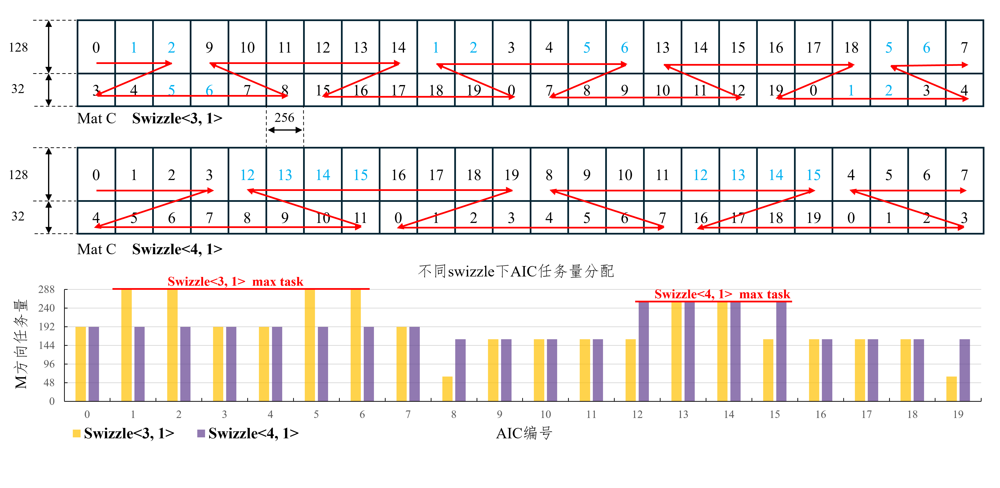

# 模板库优化指引

## CATLASS样例定位
catlass算子模板库的定位，是针对Gemm类算子提供的模板样例库，与通常的算子库有所区别。 在通常的算子库中，会针对一类问题的不同的输入样例做泛化性的优化考虑，以提供在大多数场景下较优的开箱性能。 模板库当前主要的目标，是针对不同输入提供模板样例，示例在不同输入下快速自定义开发出高性能算子，理论上并不提供相较于算子库最优的泛化性能。 例如，对于matmul场景，CANN中的matmul算子或调用接口着重通过直接调用提供泛化场景性能；而在模板库中，通过提供basic-matmul, optimized-matmul, splitk-matmul, padding-splitk-matmul等等多种matmul以示例在不同输入场景下如何自定义定制开发以获取最优性能。 仓上的多个matmul样例针对不同输入case有不同的适用范围以及调优手段，可按需定制以获取最优性能。


对于调优方法来说，总体分为**基础调优**和**进阶定制**两大类，本篇文章重点介绍第一类基础调优的方式，通过tiling调参及kernel组合的方式快速获得性能提升。

## Matmul基础知识

### C矩阵切基本块分核
首先是任务量分核逻辑，库上[00_basic_matmul](../examples/00_basic_matmul/basic_matmul.cpp)、[06_optimized_matmul](../examples/06_optimized_matmul/optimized_matmul.cpp)等样例都是对C矩阵切基本块后分核，C矩阵分别在M轴、N轴上基于`L1TileShape::M`和`L1TileShape::N`切分，得到`CeilDiv(M, L1TileShape::M) * CeilDiv(N, L1TileShape::N)`个基本块，而后基本块按照[swizzle策略](./swizzle_explanation.md)分配到cube上进行计算。

### Matmul硬件可视化
参考[昇腾社区文档-基本架构](https://www.hiascend.com/document/detail/zh/CANNCommunityEdition/83RC1alpha001/opdevg/Ascendcopdevg/atlas_ascendc_10_0008.html)。
基础matmul切块、数据搬运、计算涉及的硬件架构如下图，由于使能了doubleBuffer，在L1/L0A/L0B上会存放两块Tile数据。


### TileShape约束
由上可知TileShape在设置时要保证不能超出L1/L0A/L0B/L0C空间大小，同时TileShape取值必须是16的倍数。
- 场景一：fp16输入输出，L1TileShape<128,256,256>，L0TileShape<128,256,64>

对于输入输出是fp16场景，为了计算精度，cube核进行mmad输出到L0C上的结果是fp32数据类型，fixpipe随路传回gm时cast到fp16数据类型。
```
L1大小512K
L1实际占用 = L1::M * L1::K * 2(Byte) * 2(douberBuffer) + L1::K * L1::N * 2(Byte) * 2(douberBuffer)
        = 128 * 256 * 2 * 2 + 256 * 256 * 2 * 2
        = 393216 B = 384 KB = 3/4 L1_SIZE

L0A大小64K
L0A实际占用 = L0::M * L0::K * 2(Byte) * 2(douberBuffer)
        = 128 * 64 * 2 * 2
        = 32768 B = 32 KB = 1/2 L0A_SIZE

L0B大小64K
L0B实际占用 = L0::K * L0::N * 2(Byte) * 2(douberBuffer)
        = 64 * 256 * 2 * 2
        = 65536 B = 64 KB = 1 L0B_SIZE

L0C大小128K
L0C实际占用 = L0::M * L0::N * 4(Byte)
        = 128 * 256 * 4
        = 131072 B = 128 KB = 1 L0C_SIZE
```

- 场景二：fp32输入输出，L1TileShape<128,128,256>，L0TileShape<128,128,64>

```
L1大小512K
L1实际占用 = L1::M * L1::K * 4(Byte) * 2(douberBuffer) + L1::K * L1::N * 4(Byte) * 2(douberBuffer)
        = 128 * 256 * 4 * 2 + 128 * 256 * 4 * 2
        = 524288 B = 512 KB = 1 L1_SIZE

L0A大小64K
L0A实际占用 = L0::M * L0::K * 4(Byte) * 2(douberBuffer)
        = 128 * 64 * 4 * 2
        = 65536 B = 64 KB = 1 L0A_SIZE

L0B大小64K
L0B实际占用 = L0::K * L0::N * 4(Byte) * 2(douberBuffer)
        = 64 * 128 * 4 * 2
        = 65536 B = 64 KB = 1 L0B_SIZE

L0C大小128K
L0C实际占用 = L0::M * L0::N * 4(Byte)
        = 128 * 128 * 4
        = 65536 B = 64 KB = 1/2 L0C_SIZE
```

## 调优策略
### 样例覆盖和选择
当前库上基础Matmul算子有：

- [00_basic_matmul](../examples/00_basic_matmul/basic_matmul.cpp)，采用`MmadAtlasA2Pingpong`的dispatchPolicy，使能pingpong策略
```
template <bool ENABLE_UNIT_FLAG_ = false>
struct MmadAtlasA2Pingpong : public MmadAtlasA2  {
    static constexpr uint32_t STAGES = 2;
    static constexpr bool ENABLE_UNIT_FLAG = ENABLE_UNIT_FLAG_;
};
```
- [04_padding_matmul](../examples/04_padding_matmul/padding_matmul.cpp)，基于00_basic_matmul增加了输入矩阵的padding动作，实验发现RowMajor矩阵的shape[1]为512B对齐时，矩阵搬运效率更高，所以增加padding动作可以提高**非对齐场景**性能。
- [06_optimized_matmul](../examples/06_optimized_matmul/optimized_matmul.cpp)，采用`MmadAtlasA2Preload`的dispatchPolicy，使能预加载和shuffleK动作。预加载动作减少搬运流水的中断情况；shuffleK打乱了不同核搬运L1Tile的顺序，减少了bank冲突，使得基本块同行或同列的核在访问AB矩阵时的地址错开。同时也增加了输入矩阵向L1TileShape对齐的padding动作。相比basic_matmul引入了更多优化动作，但也引入了vector核使能和一些scalar计算的开销。
```
template <bool ENABLE_UNIT_FLAG_ = false, bool ENABLE_SHUFFLE_K_ = false>
struct MmadAtlasA2Preload : public MmadAtlasA2 {
    static constexpr uint32_t STAGES = 2;
    static constexpr bool ENABLE_UNIT_FLAG = ENABLE_UNIT_FLAG_;
    static constexpr bool ENABLE_SHUFFLE_K = ENABLE_SHUFFLE_K_;
};
```
- [09_splitk_matmul](../examples/09_splitk_matmul/splitk_matmul.cpp)，基于00_basic_matmul增加了切K轴用于分核，当M/N轴较小、切基本块较少时，切分K轴可以提高cube核利用率。但切分K轴后需要利用vector核进行累加，所以需要在K轴有一定长度时才能产生收益。
- [22_padding_splitk_matmul](../examples/22_padding_splitk_matmul/padding_splitk_matmul.cpp)，集成了`04_padding_matmul`和`09_splitk_matmul`特性，在M/N轴较小、K轴有一定长度、非对齐场景能产生性能收益。

### TileShape调整
在满足（1）16的倍数（2）不超过硬件限制 的约束下，调整TileShape尝试达到负载均衡。同时当前库上方案限制 `L1TileShape::M == L0TileShape::M`，`L0TileShape::N == L0TileShape::N`，一般推荐`L0TileShape::K == 1/4 L1TileShape::M`。
- 案例一

场景描述：A矩阵RowMajor，B矩阵ColumnMajor，M 1024，N 576，K 6144，fp16输入输出，20个AIC。

使用06_optimized_matmul，按照默认的L1TileShape<128,256,256>、L0TileShape<128,256,64>，耗时为**72.5us**（不同芯片平台、cann包、驱动下性能表现存在一定差异，仅供参考）。

分析切基本块数目为`CeilDiv(1024/128) * CeilDiv(576/256) = 24`，则20个AIC中有4个需要计算两个基本块、其余16个处理1个基本块，负载不均衡。

调整L1TileShape<256,128,256>、L0TileShape<256,128,64>，切分基本块数目为`CeilDiv(1024/256) * CeilDiv(576/128) = 20`，则20个AIC都只处理1个基本块，负载均衡，任务耗时为**48.6us**。

- 案例二

场景描述：A矩阵RowMajor，B矩阵zN，M 20，N 6144，K 16384，fp16输入输出，20个AIC。

此时B矩阵为zN格式（同NZ格式），使用21_basic_matmul_preload_zN，按照默认的L1TileShape<128,256,256>、L0TileShape<128,256,64>，耗时为**181.4us**。

分析切基本块数目为`CeilDiv(32/128) * CeilDiv(6144/256) = 24`，则20个AIC中有4个需要计算两个基本块、其余16个处理1个基本块，负载不均衡。

调整L1TileShape<32,320,128>、L0TileShape<32,320,32>，切分基本块数目为`CeilDiv(1024/256) * CeilDiv(576/128) = 20`，则20个AIC都只处理1个基本块，负载均衡，任务耗时为**139.6us**。

- ⚠️ 注意点

实验发现对于RowMajor/ColumnMajor格式，对应L1::M/L1::N/L1::K在256倍数时搬运性能更高，需要和负载均衡进行取舍；而zN格式下是否为256倍数的影响较小。
如案例二中，若B矩阵是RowMajor而不是zN排布，则默认L1TileShape<128,256,256>、L0TileShape<128,256,64>下性能为**238.8us**，而调整L1TileShape<32,320,128>、L0TileShape<32,320,32>后性能为**252.4us**，负载均衡并没有带来收益。

### Swizzle调整
首先了解[swizzle含义](./swizzle_explanation.md)，后面以<a, b>代指`Gemm::Block::GemmIdentityBlockSwizzle<a, b>`。对于AB矩阵都为RowMajor场景，一般 m > n 时选择<3, 0>，m < n时选择<3, 1>。调整swizzle时优先测试<3, 0>和<3, 1>的表现，判断`SwizzleDirection`取0还是1，而后调整`SwizzleOffset`，在一些场景中可以更好地实现负载均衡。

- 案例一

场景描述：A矩阵RowMajor，B矩阵zN，M 160，N 6144，K 2048，fp16输入输出，20个AIC。

使用21_basic_matmul_preload_zN，按照默认的L1TileShape<128,256,256>、L0TileShape<128,256,64>，swizzle设置为<3, 1>，耗时为**40.6us**。swizzle设置为<4, 1>，耗时为**35.3us**。

分析C矩阵切基本块情况，M方向切（128 + 32）两块，N方向切24个长256的块，共48个基本块。swizzle<3, 1>和swizzle<4, 1>的基本块分配AIC情况如下图。swizzle<3, 1>时，1、2、5、6号核在M方向有最大任务量为（128 + 128 + 32）；swizzle<4, 1>时，12、13、14、15号核在M方向有最大任务量为（128 + 128），负载更加均衡。


### 浅述定制调优
- 当前仓上Matmul样例各有特性和优势场景，用户可以通过深层的代码重新组装进行定制开发。例如，[21_basic_matmul_preload_zN](../examples/21_basic_matmul_preload_zN/basic_matmul_preload_zN.cpp)便是基于00_basic_matmul组装了`MmadAtlasA2Preload`的dispatchPolicy，而[22_padding_splitk_matmul](../examples/22_padding_splitk_matmul/padding_splitk_matmul.cpp)是组装了04_padding_matmul和09_splitk_matmul的特性。用户在熟悉了仓上不同样例代码后，可以根据业务场景深度开发达到更好的性能。模板库也会持续增加使用了新的算法、适合更多场景的Matmul样例。
- 除了基础的Matmul定制调优，仓上一些衍生样例（如[03_matmul_add](../examples/03_matmul_add/matmul_add.cpp)、[20_matmul_bias](../examples/20_matmul_bias/matmul_bias.cpp)等）往往是基于00_basic_matmul等样例增加新的功能，这些样例同样可以定制化地使用不同的基础Matmul样例、并进行tiling调参达到更好性能。

## 版权声明
Copyright (c) 2025 Huawei Technologies Co., Ltd.

This file is a part of the CANN Open Software.
Licensed under CANN Open Software License Agreement Version 1.0 (the "License").
Please refer to the License for details. You may not use this file except in compliance with the License.

THIS SOFTWARE IS PROVIDED ON AN "AS IS" BASIS, WITHOUT WARRANTIES OF ANY KIND,
EITHER EXPRESS OR IMPLIED,
INCLUDING BUT NOT LIMITED TO NON-INFRINGEMENT,
MERCHANTABILITY, OR FITNESS FOR A PARTICULAR   PURPOSE.
See LICENSE in the root of the software repository for the full text of the License.

## 许可证
[CANN Open Software License Agreement Version 1.0](../LICENSE)