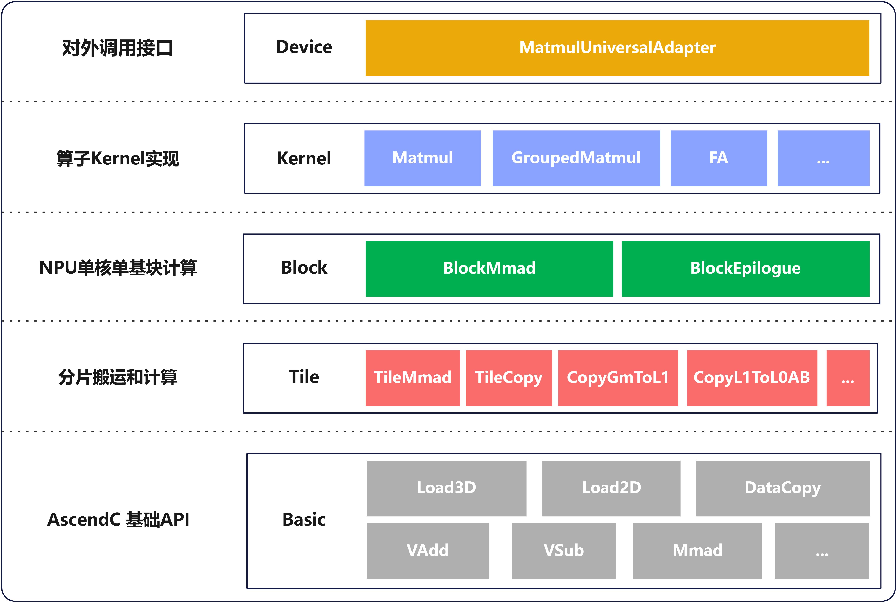
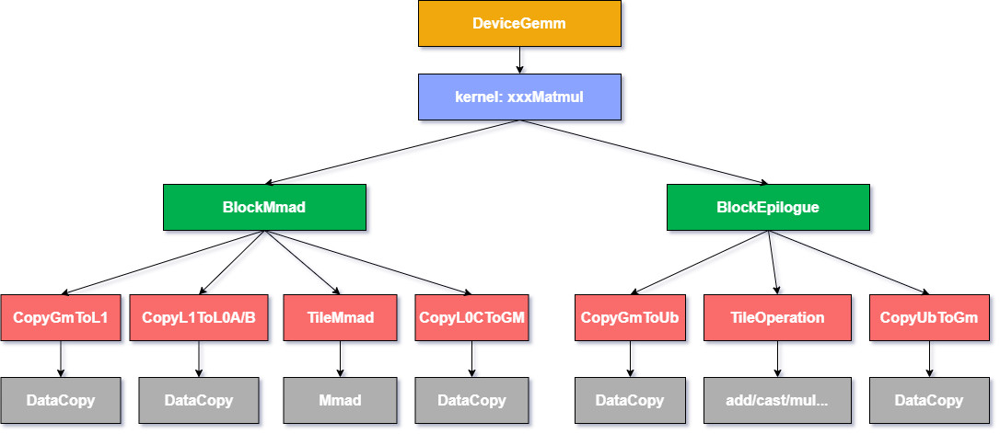
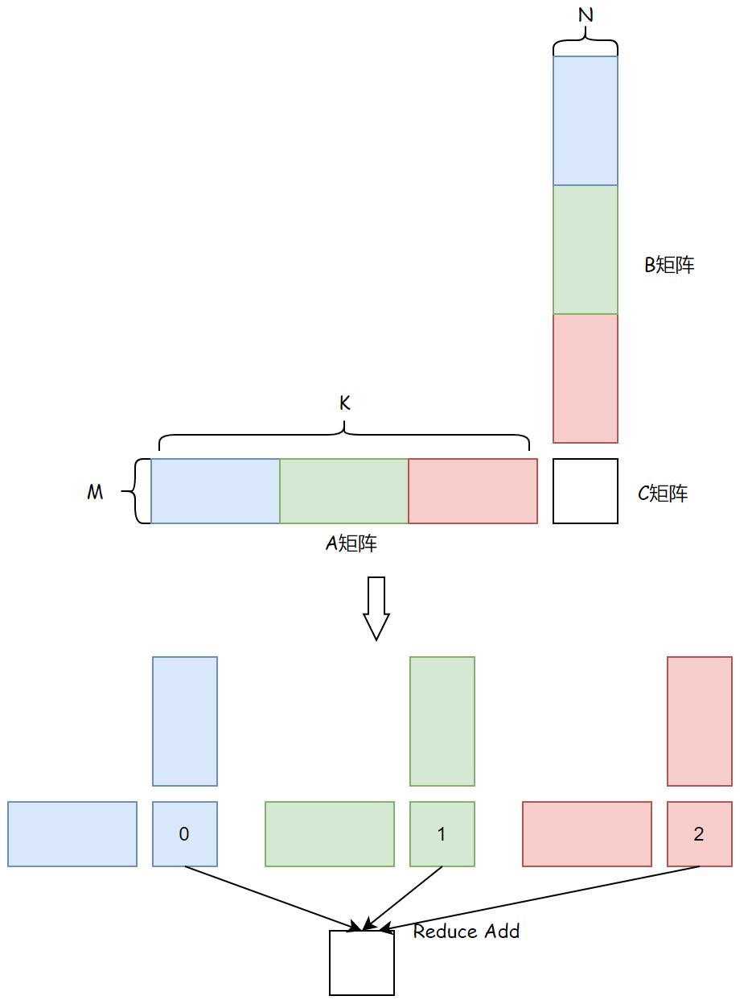

# Catlass 算子模板库开发者体验说明文档
## 项目介绍
Transformer架构中矩阵乘法（GEMM, General Matrix Multiplication）计算占据较高比重，其性能优化对提升整体计算效率至关重要。针对GEMM类算子编程，不同场景不同优化点的实现变种众多，且在算法演进和创新过程中会诞生大量新的定制化开发诉求，难以事先预备枚举。直接基于硬件能力定制开发GEMM类算子面临着开发难度大，开发周期长的问题。为此，昇腾CANN推出Catlass算子模板库，采用分层模块化设计，将GEMM计算解耦为可灵活组合的数据分块策略和计算单元配置等组件，实现快速搭建拼装的开发范式。

Catlass算子模板库通过提供可复用的模板、基础组件和典型算子实践案例，面向昇腾硬件亲和性优化，使开发者能够基于模块化组装快速完成计算流水线编排。开发者可以根据具体硬件特性和计算需求灵活定制计算内核，在确保高性能的同时，显著提升开发效率。

Catlass算子模板库采用分层抽象的设计理念，通过分析硬件架构特性和GEMM计算需求，将整体实现划分为多个层次。该设计通过模板化方式提取各层共性逻辑，同时保留必要的差异化扩展能力，使得不同层级的软件抽象能够精准对应到特定硬件结构和计算流水阶段。算法框架中的特定步骤会延迟到子类实现，使得子类能够在不改变算法整体结构的情况下，灵活重定义其中的某些关键步骤。
## 算子实现分层模块化设计

## 算子流水自定义灵活配置
模板库提供了灵活的开发方式，开发者可以复用预置的范式来快速实现基础功能，也能够针对特定需求修改模块进行定制开发，还可以通过更换组件来实现自定义的流水组合。这种设计在保证计算性能的同时，为开发者提供了充分的灵活性和拓展空间。


# 项目操作指导文档
算子模板库针对不同算子应用场景，提供了高性能的算子基础组件和算子模板实现样例。样例中包含了在昇腾硬件上可参考的实现，如高效数据搬运模式，异步流水编排技巧，高性能接口使用示例，在Block和Tile层级提供40+高性能模块示例供参考。基于这些示例开发者可以充分学习理解昇腾硬件的性能优化技术，从而针对各种优化实现场景高效完成自定义算子开发。相关样例在从上至下完全开源可参考。

## BasicMatmul体验
以BasicMatmul为例，以下代码示例将展示如何基于Catlass算子模板库快速开发实现matmul，展示BasicMatmul的搭建，编译，运行过程。
### 代码部署
配置环境变量：

```bash
source /usr/local/Ascend/ascend-toolkit/set_env.sh
```
git clone下载Catlass算子模板库源码

```bash
git clone https://gitee.com/ascend/catlass.git
```
需要依赖组件：
CANN 8.2.RC1.alpha002及之后版本
cmake >= 3.15
### 代码实现
此处以basicmatmul为例进行展示，`cd catlass/example`，创建算子目录`mkdir 21_basic_matmul`，在该目录下创建对应的算子文件`basic_matmul.cpp`和编译文件`CMakeLists.txt`。

下面将展示3段代码，需要写入basic_matmul.cpp文件中。
#### 配置头文件，定义输入参数解析结构体

```cpp
// 引入必要的头文件
#include <iostream>
#include <vector>

#include "helper.hpp"
#include "golden.hpp"
#include "fp16_t.h"

#include "catlass/catlass.hpp"
#include "catlass/arch/arch.hpp"
#include "catlass/gemm/block/block_mmad.hpp"
#include "catlass/gemm/block/block_swizzle.hpp"
#include "catlass/gemm/dispatch_policy.hpp"
#include "catlass/gemm/kernel/basic_matmul.hpp"
#include "catlass/gemm/gemm_type.hpp"
#include "catlass/layout/layout.hpp"

#include "catlass/status.hpp"
#include "catlass/gemm/device/device_gemm.hpp"

using namespace Catlass;
using fp16_t = op::fp16_t;

// 解析输入参数
struct Options {
    const std::string HELPER = "00_basic_matmul m n k [device_id]";

    GemmCoord problemShape{128, 128, 128};
    int32_t deviceId{0};

    Options() = default;

    int Parse(int argc, const char **argv)
    {
        enum ArgsIndex {
            M_INDEX = 1,
            N_INDEX,
            K_INDEX,
            DEVICE_ID_INDEX,
            ARGS_MAX
        };

        if (argc > ARGS_MAX || argc <= K_INDEX) {
            std::cerr << HELPER << std::endl;
            return -1;
        }

        problemShape.m() = std::atoi(argv[M_INDEX]);
        problemShape.n() = std::atoi(argv[N_INDEX]);
        problemShape.k() = std::atoi(argv[K_INDEX]);
        if (argc == ARGS_MAX) {
            deviceId = std::atoi(argv[DEVICE_ID_INDEX]);
        }
        return 0;
    }
};

```
#### 申请计算资源、配置Kernel模板，调用Kernel，释放计算资源

```cpp
void Run(Options const &options)  //
{
    /* 第一步，流初始化与设备侧空间申请 */
    aclrtStream stream{nullptr};
    ACL_CHECK(aclInit(nullptr));
    ACL_CHECK(aclrtSetDevice(options.deviceId));
    ACL_CHECK(aclrtCreateStream(&stream));

    // 初始化matmul矩阵的shape参数
    uint32_t m = options.problemShape.m();
    uint32_t n = options.problemShape.n();
    uint32_t k = options.problemShape.k();

    // 矩阵A的元素数量为m*k，矩阵B的元素数量为k*n，矩阵C的元素数量为m*n
    size_t lenA = static_cast<size_t>(m) * k;
    size_t lenB = static_cast<size_t>(k) * n;
    size_t lenC = static_cast<size_t>(m) * n;

    // 根据矩阵元素数量和数据类型计算矩阵占用内存大小
    size_t sizeA = lenA * sizeof(fp16_t);
    size_t sizeB = lenB * sizeof(fp16_t);
    size_t sizeC = lenC * sizeof(fp16_t);

    // 初始化数据排布格式，RowMajor表示行优先
    using LayoutA = layout::RowMajor;
    using LayoutB = layout::RowMajor;
    using LayoutC = layout::RowMajor;
    LayoutA layoutA{m, k};
    LayoutB layoutB{k, n};
    LayoutC layoutC{m, n};

    // 初始化输入数据
    std::vector<fp16_t> hostA(lenA);
    std::vector<fp16_t> hostB(lenB);
    golden::FillRandomData<fp16_t>(hostA, -5.0f, 5.0f);
    golden::FillRandomData<fp16_t>(hostB, -5.0f, 5.0f);

    // 申请A矩阵在device上的内存，并将A矩阵拷贝至device
    uint8_t *deviceA{nullptr};
    ACL_CHECK(aclrtMalloc(reinterpret_cast<void **>(&deviceA), sizeA, ACL_MEM_MALLOC_HUGE_FIRST));
    ACL_CHECK(aclrtMemcpy(deviceA, sizeA, hostA.data(), sizeA, ACL_MEMCPY_HOST_TO_DEVICE));
    
    // 申请B矩阵在device上的内存，并将B矩阵拷贝至device
    uint8_t *deviceB{nullptr};
    ACL_CHECK(aclrtMalloc(reinterpret_cast<void **>(&deviceB), sizeB, ACL_MEM_MALLOC_HUGE_FIRST));
    ACL_CHECK(aclrtMemcpy(deviceB, sizeB, hostB.data(), sizeB, ACL_MEMCPY_HOST_TO_DEVICE));

    // 申请C矩阵在device上的内存
    uint8_t *deviceC{nullptr};
    ACL_CHECK(aclrtMalloc(reinterpret_cast<void **>(&deviceC), sizeC, ACL_MEM_MALLOC_HUGE_FIRST));

    // 获取当前硬件核心数量
    auto aicCoreNum = platform_ascendc::PlatformAscendCManager::GetInstance()->GetCoreNumAic();

    /* 第二步，选择优化策略 */
    using ArchTag = Arch::AtlasA2;
    using DispatchPolicy = Gemm::MmadAtlasA2Pingpong<true>;

    // 定义tiling切分策略
    using L1TileShape = GemmShape<128, 256, 256>;
    using L0TileShape = GemmShape<128, 256, 64>;

    /* 第三步，选择数据类型，并组装模板样例组件 */
    using AType = Gemm::GemmType<half, LayoutA>;
    using BType = Gemm::GemmType<half, LayoutB>;
    using CType = Gemm::GemmType<half, LayoutC>;
    
    // 定义Block层进行矩阵乘计算的组件
    using BlockMmad = Gemm::Block::BlockMmad<DispatchPolicy, L1TileShape, L0TileShape, AType, BType, CType>;
    using BlockEpilogue = void;

    // 配置Block调度器，指定Block粒度的swizzle次序
    using BlockScheduler = typename Gemm::Block::GemmIdentityBlockSwizzle<3, 0>;

    // 指定kernel
    using MatmulKernel = Gemm::Kernel::BasicMatmul<BlockMmad, BlockEpilogue, BlockScheduler>;
    
    // 定义Device层适配器
    using MatmulAdapter = Gemm::Device::DeviceGemm<MatmulKernel>;
    MatmulKernel::Arguments arguments{options.problemShape, deviceA, deviceB, deviceC};

    /* 第四步，执行模板样例 */
    //定义适配器对象
    MatmulAdapter matmul_op;
    //判断kernel对相关参数可执行
    matmul_op.CanImplement(arguments);
    size_t sizeWorkspace = matmul_op.GetWorkspaceSize(arguments);
    uint8_t *deviceWorkspace = nullptr;
    if (sizeWorkspace > 0) {
        ACL_CHECK(
            aclrtMalloc(reinterpret_cast<void **>(&deviceWorkspace), sizeWorkspace, ACL_MEM_MALLOC_HUGE_FIRST));
    }
    // 初始化
    matmul_op.Initialize(arguments, deviceWorkspace);
    // 调用执行
    matmul_op(stream, aicCoreNum);
    ACL_CHECK(aclrtSynchronizeStream(stream));
    if (sizeWorkspace > 0) {
        ACL_CHECK(aclrtFree(deviceWorkspace));
    }
    
    // 将输出数据搬出
    std::vector<fp16_t> hostC(lenC);
    ACL_CHECK(aclrtMemcpy(hostC.data(), sizeC, deviceC, sizeC, ACL_MEMCPY_DEVICE_TO_HOST));
    
    // 计算精度标杆并与输出数据比对
    std::vector<float> hostGolden(lenC);
    golden::ComputeMatmul(options.problemShape, hostA, layoutA, hostB, layoutB, hostGolden, layoutC);

    std::vector<uint64_t> errorIndices = golden::CompareData(hostC, hostGolden, k);
    if (errorIndices.empty()) {
        std::cout << "Compare success." << std::endl;
    } else {
        std::cerr << "Compare failed. Error count: " << errorIndices.size() << std::endl;
    }

    // 释放资源
    ACL_CHECK(aclrtFree(deviceA));
    ACL_CHECK(aclrtFree(deviceB));
    ACL_CHECK(aclrtFree(deviceC));

    ACL_CHECK(aclrtDestroyStream(stream));
    ACL_CHECK(aclrtResetDevice(options.deviceId));
    ACL_CHECK(aclFinalize());
}

```
#### 定义main函数

```cpp
int main(int argc, const char **argv)
{
    Options options;
    if (options.Parse(argc, argv) != 0) {
        return -1;
    }
    Run(options);
    return 0;
}
```
### 编译运行
#### 编辑编译文件
在算子目录下（即basic_matmul.cpp同级目录）的CMakeLists.txt文件中加入以下代码

```
set_source_files_properties(basic_matmul.cpp PROPERTIES LANGUAGE ASCEND)
catlass_example_add_executable(
    21_basic_matmul
    dav-c220
    basic_matmul.cpp
)
```
在example目录下的CMakeLists.txt文件的foreach循环中加入该算子的信息。

```
foreach(EXAMPLE
    21_basic_matmul
)

```
foreach中已有20个项目，在列表后面追加即可。
#### 编译
在catlass目录下(请仔细核对执行目录)，执行`bash scripts/build.sh 21_basic_matmul`命令即可进行编译。
#### 执行
`cd output/bin`目录，执行`./21_basic_matmul 128 256 4096 0`命令执行算子。
执行结果如出现`Compare success`。说明精度比对成功。(由于使用CPU进行精度对比，所以执行需要一点时间)

#### 性能测试
执行`msprof op ./21_basic_matmul 128 256 4096 0`命令即可调用msprof工具对算子进行性能测试。
执行完毕后会在同目录下生成“OPPROF_xxxx”文件夹，进入该文件夹，查看`OpBasicInfo.csv`文件，其中`“Task Duration(us)”`表示该算子执行的耗时。
#### tiling调优
此处展示如何通过调整tile shape对算子的性能进行优化。
通过改动上面代码中的下面两行代码改动tile shape：
```cpp
// 定义tiling切分策略
using L1TileShape = GemmShape<128, 256, 256>;
using L0TileShape = GemmShape<128, 256, 64>;
```
**case1** `m, n, k = 128, 256, 4096`
1. 使用初始的TileShape， `L1TileShape: <128,256,256>`, `L0TileShape: <128,256,64>`，
执行命令`msprof op ./21_basic_matmul 128 256 4096 0`,测试算子在当前tileShape下的性能。
2. 修改TileShape为 `L1TileShape: <32,128,256>`, `L0TileShape: <32,128,64>`，
3. 重新编译后，执行命令`msprof op ./21_basic_matmul 128 256 4096 0`，测试算子修改tileShape后的性能。通过比对tileShape修改前后的性能，观察调整tiling对算子性能的影响。

**case2** `m, n, k = 16, 16, 32768`
1. 使用初始的TileShape `L1TileShape: <128,256,256>`, `L0TileShape: <128,256,64>`，
执行命令`msprof op ./21_basic_matmul 128 256 4096 0`,测试算子在当前tileShape下的性能。
2. 修改TileShape为 `L1TileShape: <16,16,2048>`, `L0TileShape: <16,16, 64>`，
3. 重新编译后，执行命令`msprof op ./21_basic_matmul 128 256 4096 0`，测试算子修改tileShape后的性能。通过比对tileShape修改前后的性能，观察调整tiling对算子性能的影响。

## SplitK Matmul体验
### 原理说明


由于硬件约束，基本块的大小最小为`16x16`，如果Matmul的M和N轴很小，例如`M=16,N=16`,那么只能划分出一个基本块，只能利用一个计算核心，浪费了很多计算资源，如图所示，如果K方向足够大，可以对K方向进行切分，从而话分出更多的任务块，利用更多的计算核心，提高计算效率。
### 代码实现
首先在`example`目录下面创建新文件夹，命名为`22_splitk_matmul`，然后在该文件夹下创建新文件`splitk_matmul.cpp`。
#### 更改包含的头文件（此处仅供说明，请使用下面完整代码进行实验）
```cpp
#include "catlass/gemm/kernel/splitk_matmul.hpp"
```
SplitK Matmul在Basic Matmul的基础上扩展，对Matmul的K方向进行切分，从而增加基本任务块数量，充分利用计算资源。需要将原来的kernel层头文件更换为`atlass/gemm/kernel/splitk_matmul.hpp`，其他组件和BasicMamtul相同。

#### 更改Kernel配置（此处仅供说明，请使用下面完整代码进行实验）
SplitK Matmul先利用Cube Core算出各个基本块的部分和，然后由Vector Core进行累加，为了不损失精度，累加过程采用`float`类型。由于对K轴进行了切分，SplitkMatmul的BlockScheduler是定制化的，BlockScheduler组件决定基本块的遍历方式，SplitkMatmul需要拆分K轴进行遍历，所以需要定制化BlockScheduler，实际开发可基于BasicMamtul的BlockScheduler进行修改，缩短开发时间。
```cpp
using AType = Gemm::GemmType<half, LayoutA>;
using BType = Gemm::GemmType<half, LayoutB>;
using CType = Gemm::GemmType<float, LayoutC>;

using BlockMmad = Gemm::Block::BlockMmad<DispatchPolicy, L1TileShape, L0TileShape, AType, BType, CType>;
using BlockEpilogue = void;

// After the Matmul computation is completed, launch the ReduceAdd kernel to accumulate the partial sums.
constexpr uint32_t computeLength = 32 * 1024 / sizeof(float);
using ReduceAdd = Catlass::Gemm::Kernel::ReduceAdd<ArchTag, float, half, computeLength>;

// Swizzle offset is 3 and direction is 0.
using BlockScheduler = typename Gemm::Block::SplitkGemmIdentityBlockSwizzle<3, 0>;

// kernel level
using MatmulKernel = Gemm::Kernel::SplitkMatmul<BlockMmad, BlockEpilogue, BlockScheduler, ReduceAdd>;

using MatmulAdapter = Gemm::Device::DeviceGemm<MatmulKernel>;
MatmulKernel::Arguments arguments{options.problemShape,
    aicCoreNum,
    sizeof(float),
    deviceA,
    deviceB,
    deviceC};
MatmulAdapter matmul_op;
matmul_op.CanImplement(arguments);

size_t sizeWorkspace = matmul_op.GetWorkspaceSize(arguments);
uint8_t *deviceWorkspace = nullptr;
if (sizeWorkspace > 0) {
    ACL_CHECK(
        aclrtMalloc(reinterpret_cast<void **>(&deviceWorkspace), sizeWorkspace, ACL_MEM_MALLOC_HUGE_FIRST)
    );
}
matmul_op.Initialize(arguments, deviceWorkspace);
matmul_op(stream, aicCoreNum, fftsAddr);
```
#### 最终完整代码如下：
```cpp
#ifndef K_MAX_SHAPE_DIM
#define K_MAX_SHAPE_DIM 0
#endif

#include <iostream>
#include <vector>

#include "helper.hpp"
#include "golden.hpp"
#include "fp16_t.h"

#include "catlass/catlass.hpp"
#include "catlass/arch/arch.hpp"
#include "catlass/gemm/block/block_mmad.hpp"
#include "catlass/gemm/block/block_swizzle.hpp"
#include "catlass/gemm/dispatch_policy.hpp"
#include "catlass/gemm/kernel/splitk_matmul.hpp"
#include "catlass/gemm/gemm_type.hpp"
#include "catlass/layout/layout.hpp"

#include "catlass/status.hpp"
#include "catlass/gemm/device/device_gemm.hpp"

using namespace Catlass;
using fp16_t = op::fp16_t;


struct Options {
    const std::string HELPER = "09_splitk_matmul m n k [device_id]";

    GemmCoord problemShape{128, 128, 128};
    int32_t deviceId{0};

    Options() = default;

    int Parse(int argc, const char **argv)
    {
        enum ArgsIndex {
            M_INDEX = 1,
            N_INDEX,
            K_INDEX,
            DEVICE_ID_INDEX,
            ARGS_MAX
        };

        if (argc > ARGS_MAX || argc <= K_INDEX) {
            std::cerr << HELPER << std::endl;
            return -1;
        }

        problemShape.m() = std::atoi(argv[M_INDEX]);
        problemShape.n() = std::atoi(argv[N_INDEX]);
        problemShape.k() = std::atoi(argv[K_INDEX]);
        if (argc == ARGS_MAX) {
            deviceId = std::atoi(argv[DEVICE_ID_INDEX]);
        }
        return 0;
    }
};


void Run(Options const &options)
{
    aclrtStream stream{nullptr};

    ACL_CHECK(aclInit(nullptr));
    ACL_CHECK(aclrtSetDevice(options.deviceId));
    ACL_CHECK(aclrtCreateStream(&stream));

    // Prepare FFTS address
    uint64_t fftsAddr{0};
    uint32_t fftsLen{0};
    RT_CHECK(rtGetC2cCtrlAddr(&fftsAddr, &fftsLen));

    // Get the number of cube cores of the current hardware
    auto aicCoreNum = platform_ascendc::PlatformAscendCManager::GetInstance()->GetCoreNumAic();

    uint32_t m = options.problemShape.m();
    uint32_t n = options.problemShape.n();
    uint32_t k = options.problemShape.k();
    
    size_t lenA = static_cast<size_t>(m) * k;
    size_t lenB = static_cast<size_t>(k) * n;
    size_t lenC = static_cast<size_t>(m) * n;

    size_t sizeA = lenA * sizeof(fp16_t);
    size_t sizeB = lenB * sizeof(fp16_t);
    size_t sizeC = lenC * sizeof(fp16_t);

    using LayoutA = layout::RowMajor;
    using LayoutB = layout::RowMajor;
    using LayoutC = layout::RowMajor;
    LayoutA layoutA{m, k};
    LayoutB layoutB{k, n};
    LayoutC layoutC{m, n};

    std::vector<fp16_t> hostA(lenA);
    std::vector<fp16_t> hostB(lenB);
    golden::FillRandomData<fp16_t>(hostA, -5.0f, 5.0f);
    golden::FillRandomData<fp16_t>(hostB, -5.0f, 5.0f);

    uint8_t *deviceA{nullptr};
    ACL_CHECK(aclrtMalloc(reinterpret_cast<void **>(&deviceA), sizeA, ACL_MEM_MALLOC_HUGE_FIRST));
    ACL_CHECK(aclrtMemcpy(deviceA, sizeA, hostA.data(), sizeA, ACL_MEMCPY_HOST_TO_DEVICE));

    uint8_t *deviceB{nullptr};
    ACL_CHECK(aclrtMalloc(reinterpret_cast<void **>(&deviceB), sizeB, ACL_MEM_MALLOC_HUGE_FIRST));
    ACL_CHECK(aclrtMemcpy(deviceB, sizeB, hostB.data(), sizeB, ACL_MEMCPY_HOST_TO_DEVICE));

    uint8_t *deviceC{nullptr};
    ACL_CHECK(aclrtMalloc(reinterpret_cast<void **>(&deviceC), sizeC, ACL_MEM_MALLOC_HUGE_FIRST));

    using ArchTag = Arch::AtlasA2;
    using DispatchPolicy = Gemm::MmadAtlasA2Pingpong<true>;
    using L1TileShape = GemmShape<128, 256, 256>;
    using L0TileShape = GemmShape<128, 256, 64>;

    using AType = Gemm::GemmType<half, LayoutA>;
    using BType = Gemm::GemmType<half, LayoutB>;
    using CType = Gemm::GemmType<float, LayoutC>;

    using BlockMmad = Gemm::Block::BlockMmad<DispatchPolicy, L1TileShape, L0TileShape, AType, BType, CType>;
    using BlockEpilogue = void;

    // After the Matmul computation is completed, launch the ReduceAdd kernel to accumulate the partial sums.
    constexpr uint32_t computeLength = 32 * 1024 / sizeof(float);
    using ReduceAdd = Catlass::Gemm::Kernel::ReduceAdd<ArchTag, float, half, computeLength>;

    // Swizzle offset is 3 and direction is 0.
    using BlockScheduler = typename Gemm::Block::SplitkGemmIdentityBlockSwizzle<3, 0>;

    // kernel level
    using MatmulKernel = Gemm::Kernel::SplitkMatmul<BlockMmad, BlockEpilogue, BlockScheduler, ReduceAdd>;

    using MatmulAdapter = Gemm::Device::DeviceGemm<MatmulKernel>;
    MatmulKernel::Arguments arguments{options.problemShape,
        aicCoreNum,
        sizeof(float),
        deviceA,
        deviceB,
        deviceC};
    MatmulAdapter matmul_op;
    matmul_op.CanImplement(arguments);

    size_t sizeWorkspace = matmul_op.GetWorkspaceSize(arguments);
    uint8_t *deviceWorkspace = nullptr;
    if (sizeWorkspace > 0) {
        ACL_CHECK(
            aclrtMalloc(reinterpret_cast<void **>(&deviceWorkspace), sizeWorkspace, ACL_MEM_MALLOC_HUGE_FIRST)
        );
    }
    matmul_op.Initialize(arguments, deviceWorkspace);
    matmul_op(stream, aicCoreNum, fftsAddr);
    ACL_CHECK(aclrtSynchronizeStream(stream));

    std::vector<fp16_t> hostC(lenC);
    ACL_CHECK(aclrtMemcpy(hostC.data(), sizeC, deviceC, sizeC, ACL_MEMCPY_DEVICE_TO_HOST));

    std::vector<float> hostGolden(lenC);
    golden::ComputeMatmul(options.problemShape, hostA, layoutA, hostB, layoutB, hostGolden, layoutC);

    std::vector<uint64_t> errorIndices = golden::CompareData(hostC, hostGolden, k);
    if (errorIndices.empty()) {
        std::cout << "Compare success." << std::endl;
    } else {
        std::cerr << "Compare failed. Error count: " << errorIndices.size() << std::endl;
    }

    ACL_CHECK(aclrtFree(deviceA));
    ACL_CHECK(aclrtFree(deviceB));
    ACL_CHECK(aclrtFree(deviceC));
    if (sizeWorkspace > 0) {
        ACL_CHECK(aclrtFree(deviceWorkspace));
    }

    ACL_CHECK(aclrtDestroyStream(stream));
    ACL_CHECK(aclrtResetDevice(options.deviceId));
    ACL_CHECK(aclFinalize());
}

int main(int argc, const char **argv)
{
    Options options;
    if (options.Parse(argc, argv) != 0) {
        return -1;
    }
    Run(options);
    return 0;
}
```
### 编译运行
在`splitk_matmul.cpp`同级文件夹下创建`CMakeLists.txt`文件，填如以下内容：
```cmake
set_source_files_properties(splitk_matmul.cpp PROPERTIES LANGUAGE ASCEND)
catlass_example_add_executable(
    22_splitk_matmul # 可执行程序名称
    dav-c220
    splitk_matmul.cpp
)
```
然后在example下的，填入文件夹名称：
```cmake
foreach(EXAMPLE
    22_splitk_matmul
)
```
运行脚本进行编译：
```bash
bash scripts/build.sh 22_splitk_matmul
```
执行程序：
```bash
# ./output/bin/22_splitk_matmul m n k [device_id]
./output/bin/22_splitk_matmul 16 16 32768 0
```

### 性能测试
使用msprof op采集性能数据：
```bash
msprof op ./output/bin/22_splitk_matmul 16 16 32768 0
```
在当前目录下会生成profiling数据，查看`OpBasicInfo.csv`文件获取性能数据。可将该性能数据与Basic Matmul的性能数据进行比较，观察收益。

## GroupMatmul体验
### 代码组装
首先在`example`目录下面创建新文件夹，命名为`23_grouped_matmul`，然后在该文件夹下创建新文件`grouped_matmul.cpp`。写入以下代码：
```cpp
// 如果不需使用AscendC Tensor中的ShapeInfo信息，可以设置K_MAX_SHAPE_DIM为0减少使用的栈空间
#ifndef K_MAX_SHAPE_DIM
#define K_MAX_SHAPE_DIM 0
#endif

#include <iostream>
#include <vector>
#include <cstdlib>

#include "helper.hpp"
#include "golden.hpp"
#include "fp16_t.h"

#include "catlass/catlass.hpp"
#include "catlass/arch/arch.hpp"
#include "catlass/gemm/block/block_mmad.hpp"
#include "catlass/gemm/block/block_swizzle.hpp"
#include "catlass/gemm/dispatch_policy.hpp"
#include "catlass/gemm/kernel/grouped_matmul_slice_m.hpp"
#include "catlass/gemm/gemm_type.hpp"
#include "catlass/layout/layout.hpp"
#include "catlass/status.hpp"
#include "catlass/gemm/device/device_gemm.hpp"

using namespace Catlass;
using fp16_t = op::fp16_t;

// 解析输入参数
struct Options {
    const std::string HELPER = "02_grouped_matmul_slice_m group_count m n k [device_id]";
    enum ParseStatus { SUCCESS = 0, FAILED};
    enum ArgsIndex { GROUP_COUNT_INDEX = 1, M_INDEX, N_INDEX, K_INDEX, DEVICE_ID_INDEX, ARGS_MAX };

    uint32_t groupCount{0};
    GemmCoord problemShape{0, 0, 0};
    uint32_t deviceId{0};

    Options() = default;

    ParseStatus ParseArg(ArgsIndex index, uint32_t& arg, int argc, const char **argv)
    {
        try {
            if (std::stoi(argv[index]) > 0) {
                arg = std::stoi(argv[index]);
                return SUCCESS;
            } else {
                std::cerr << "argument must be greater than 0"<< std::endl;
                return FAILED;
            }
        } catch (const std::invalid_argument& e) {
            std::cerr << "invalid argument: " << e.what() << std::endl;
            return FAILED;
        }
    }

    int Parse(int argc, const char **argv)
    {
        if (argc > ARGS_MAX || argc <= K_INDEX) {
            std::cerr << HELPER << std::endl;
            return FAILED;
        }
        if (ParseArg(GROUP_COUNT_INDEX, groupCount, argc, argv) != SUCCESS) return FAILED;
        if (ParseArg(M_INDEX, problemShape.m(), argc, argv) != SUCCESS) return FAILED;
        if (ParseArg(N_INDEX, problemShape.n(), argc, argv) != SUCCESS) return FAILED;
        if (ParseArg(K_INDEX, problemShape.k(), argc, argv) != SUCCESS) return FAILED;
        
        if (argc == ARGS_MAX) {
            try {
                if (std::stoi(argv[DEVICE_ID_INDEX]) >= 0) {
                    deviceId = std::stoi(argv[DEVICE_ID_INDEX]);
                    return SUCCESS;
                } else {
                    std::cerr << "deviced id cannot be negative"<< std::endl;
                    return FAILED;
                }
            } catch (const std::invalid_argument& e) {
                std::cerr << "invalid argument: " << e.what() << std::endl;
                return FAILED;
            }
        }
        return SUCCESS;
    }
};

// 释放设备侧内存空间
void FreeDeviceMemory(std::initializer_list<uint8_t*> pointers)
{
    for (uint8_t* ptr : pointers) {
        ACL_CHECK(aclrtFree(ptr));
    }
}

// 申请计算资源、配置Kernel模板，调用Kernel，释放计算资源
aclError Run(Options const &options)  //
{
    /* 第一步，流初始化与设备侧空间申请 */
    aclrtStream stream{nullptr};
    ACL_CHECK(aclInit(nullptr));
    ACL_CHECK(aclrtSetDevice(options.deviceId));
    ACL_CHECK(aclrtCreateStream(&stream));

    uint32_t problemCount = options.groupCount;
    uint32_t m = options.problemShape.m();
    uint32_t n = options.problemShape.n();
    uint32_t k = options.problemShape.k();

    size_t lenA = static_cast<size_t>(m) * k;
    size_t lenB = static_cast<size_t>(k) * n * problemCount;
    size_t lenC = static_cast<size_t>(m) * n;

    size_t sizeA = lenA * sizeof(fp16_t);
    size_t sizeB = lenB * sizeof(fp16_t);
    size_t sizeC = lenC * sizeof(fp16_t);

    using LayoutA = layout::RowMajor;
    using LayoutB = layout::ColumnMajor;
    using LayoutC = layout::RowMajor;

    std::vector<fp16_t> hostA(lenA);
    std::vector<fp16_t> hostB(lenB);
    auto groupList = golden::GenerateGroupList<int64_t>(m, problemCount);

    size_t sizeGroupList = problemCount * sizeof(int64_t);
    uint8_t *deviceGroupList{nullptr};

    aclError status;
    status = aclrtMalloc(reinterpret_cast<void **>(&deviceGroupList), sizeGroupList, ACL_MEM_MALLOC_HUGE_FIRST);
    if (status != ACL_ERROR_NONE) {
        return status;
    }
    status = aclrtMemcpy(deviceGroupList, sizeGroupList, groupList.data(), sizeGroupList, ACL_MEMCPY_HOST_TO_DEVICE);
    if (status != ACL_ERROR_NONE) {
        FreeDeviceMemory({deviceGroupList});
        return status;
    }

    uint8_t *deviceA{nullptr};
    status = aclrtMalloc(reinterpret_cast<void **>(&deviceA), sizeA, ACL_MEM_MALLOC_HUGE_FIRST);
    if (status != ACL_ERROR_NONE) {
        FreeDeviceMemory({deviceGroupList});
        return status;
    }
    status = aclrtMemcpy(deviceA, sizeA, hostA.data(), sizeA, ACL_MEMCPY_HOST_TO_DEVICE);
    if (status != ACL_ERROR_NONE) {
        FreeDeviceMemory({deviceGroupList, deviceA});
        return status;
    }

    uint8_t *deviceB{nullptr};
    status = aclrtMalloc(reinterpret_cast<void **>(&deviceB), sizeB, ACL_MEM_MALLOC_HUGE_FIRST);
    if (status != ACL_ERROR_NONE) {
        FreeDeviceMemory({deviceGroupList, deviceA});
        return status;
    }
    status = aclrtMemcpy(deviceB, sizeB, hostB.data(), sizeB, ACL_MEMCPY_HOST_TO_DEVICE);
    if (status != ACL_ERROR_NONE) {
        FreeDeviceMemory({deviceGroupList, deviceA, deviceB});
        return status;
    }

    uint8_t *deviceC{nullptr};
    status = aclrtMalloc(reinterpret_cast<void **>(&deviceC), sizeC, ACL_MEM_MALLOC_HUGE_FIRST);
    if (status != ACL_ERROR_NONE) {
        FreeDeviceMemory({deviceGroupList, deviceA, deviceB});
        return status;
    }

    // 获取当前硬件核心数量
    auto aicCoreNum = platform_ascendc::PlatformAscendCManager::GetInstance()->GetCoreNumAic();

    /* 第二步，选择优化策略 */

    /* 配置一 */
    using ArchTag = Arch::AtlasA2;
    constexpr bool enableUnitFlag = true;
    using DispatchPolicy = Gemm::MmadAtlasA2Pingpong<enableUnitFlag>;
    using L1TileShape = GemmShape<128, 256, 256>;
    using L0TileShape = GemmShape<128, 256, 64>;
    using BlockScheduler = typename Gemm::Block::GemmIdentityBlockSwizzle<1, 1>;

    /* 配置二 */
    // using ArchTag = Arch::AtlasA2;
    // constexpr uint32_t preloadStages = 1;
    // constexpr uint32_t l1Stages = 2;
    // constexpr uint32_t l0AStages = 2;
    // constexpr uint32_t l0BStages = 4;
    // constexpr uint32_t l0CStages = 1;
    // constexpr bool enableUnitFlag = true;
    // constexpr bool enableShuffleK = true;
    // using DispatchPolicy = Gemm::MmadAtlasA2PreloadAsync<preloadStages,
    //     l1Stages,
    //     l0AStages,
    //     l0BStages,
    //     l0CStages,
    //     enableUnitFlag,
    //     enableShuffleK>;
    // using L1TileShape = GemmShape<256, 128, 256>;
    // using L0TileShape = GemmShape<256, 128, 64>;
    // using BlockScheduler = typename Gemm::Block::GemmIdentityBlockSwizzle<3, 0>;

    /* 第三步，选择数据类型，并组装模板样例组件 */
    using AType = Gemm::GemmType<half, LayoutA>;
    using BType = Gemm::GemmType<half, LayoutB>;
    using CType = Gemm::GemmType<half, LayoutC>;

    using BlockMmad = Gemm::Block::BlockMmad<DispatchPolicy, L1TileShape, L0TileShape, AType, BType, CType>;
    using BlockEpilogue = void;

    using MatmulKernel = Gemm::Kernel::GroupedMatmulSliceM<BlockMmad, BlockEpilogue, BlockScheduler, int64_t>;
    using MatmulAdapter = Gemm::Device::DeviceGemm<MatmulKernel>;
    MatmulKernel::Arguments arguments{options.problemShape, problemCount, deviceGroupList, deviceA, deviceB, deviceC};

    /* 第四步，执行模板样例 */
    MatmulAdapter matmulOp;
    matmulOp.CanImplement(arguments);
    uint8_t *deviceWorkspace{nullptr};
    size_t sizeWorkspace = matmulOp.GetWorkspaceSize(arguments);
    if (sizeWorkspace > 0) {
        status = aclrtMalloc(reinterpret_cast<void **>(&deviceWorkspace), sizeWorkspace, ACL_MEM_MALLOC_HUGE_FIRST);
        if (status != ACL_ERROR_NONE) {
            FreeDeviceMemory({deviceGroupList, deviceA, deviceB, deviceC});
            return status;
        }
    }
    matmulOp.Initialize(arguments, deviceWorkspace);
    matmulOp(stream, aicCoreNum);

    status = aclrtSynchronizeStream(stream);
    if (status != ACL_ERROR_NONE) {
        FreeDeviceMemory({deviceGroupList, deviceA, deviceB, deviceC});
        if (sizeWorkspace > 0) {
            FreeDeviceMemory({deviceWorkspace});
        }
        return status;
    }

    std::vector<fp16_t> hostC(lenC);
    status = aclrtMemcpy(hostC.data(), sizeC, deviceC, sizeC, ACL_MEMCPY_DEVICE_TO_HOST);
    if (status != ACL_ERROR_NONE) {
        FreeDeviceMemory({deviceGroupList, deviceA, deviceB, deviceC});
        if (sizeWorkspace > 0) {
            FreeDeviceMemory({deviceWorkspace});
        }
        return status;
    }

    /* 第五步，释放设备侧空间 */
    FreeDeviceMemory({deviceGroupList, deviceA, deviceB, deviceC});
    if (sizeWorkspace > 0) {
        FreeDeviceMemory({deviceWorkspace});
    }
    ACL_CHECK(aclrtDestroyStream(stream));
    ACL_CHECK(aclrtResetDevice(options.deviceId));
    ACL_CHECK(aclFinalize());
    return status;
}

int main(int argc, const char **argv)
{
    Options options;
    if (options.Parse(argc, argv) == Options::ParseStatus::SUCCESS) {
        aclError status = Run(options); 
        if (status != ACL_ERROR_NONE) { 
            std::cerr << "aclError: " << status << std::endl;
        }
    }
    return 0;
}
```
### 编译运行
在`grouped_matmul.cpp`同级文件夹下创建`CMakeLists.txt`文件，填如以下内容：
```cmake
set_source_files_properties(grouped_matmul.cpp PROPERTIES LANGUAGE ASCEND)
catlass_example_add_executable(
    23_grouped_matmul # 可执行程序名称
    dav-c220
    grouped_matmul.cpp
)
```
然后在example下的，填入文件夹名称：
```cmake
foreach(EXAMPLE
    23_grouped_matmul
)
```
运行脚本进行编译：
```bash
bash scripts/build.sh 23_grouped_matmul
```
执行程序：
```bash
# ./output/bin/23_grouped_matmul group_count m n k [device_id]
./output/bin/23_grouped_matmul 128 32768 1280 4096 0
# msprof op测试程序性能
msprof op ./output/bin/23_grouped_matmul 128 32768 1280 4096 0
```
### 切换配置，观察性能变化
以上代码中有两种配置策略，分别是配置一和配置二，配置一为通常的简单配置，配置二为优化配置，增加了`Preload，ShuffleK`两个优化措施，两者使用不同的block层实现，展示了模板库可按需组装搭配各组件的特性。
分别采用配置一和配置二测试同一组shape，例如下面的shape：group_count=64,m=49152,n=1280,k=4096。观察配置一和配置二的性能差别。（**请找到上面代码中的配置一和配置二，使用一个配置时注释另一个**）